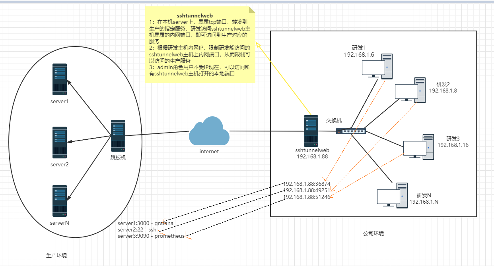
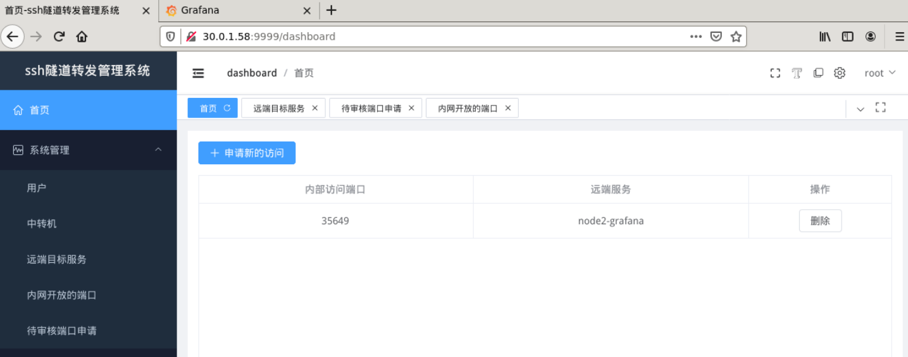
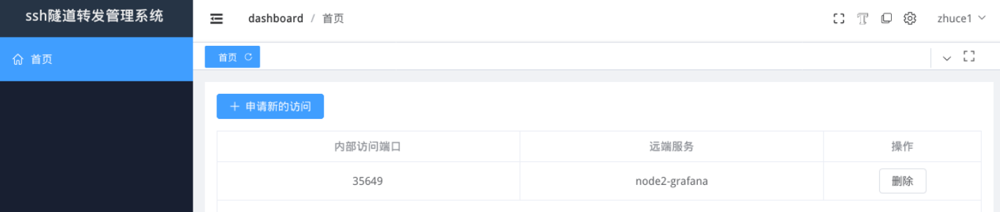

# sshtunnelweb



```
新手练习项目
gin + zaplog + jwt + cfg + sqlite实现的基于IP的控制内部访问生产服务的ssh隧道转发系统
```
1. 修改配置文件，根据需求设置自定义的参数：比如日志存放目录/内置admin的账户/sqlite文件存放目录/jwt的过期时间
2. 服务启动后，要先配置中转机：即要借助的ssh隧道转发主机，填写ssh登录的IP,PORT,USERNAME,PASSWD
3. 在远程服务中，添加可以让申请访问的目标服务；比如生产中的grafana，prometheus等服务
4. 内置一个初始化的admin账户，账户信息可以在配置文件config.yaml中先配置，然后启动(该账户要删除，需要操作db，web端无法删除)
5. 普通账户需要申请，才通过显示的内网端口，访问对应的生产服务。admin权限账户无此限制
6. 普通账户申请后，需要admin权限账户审批，通过后才能访问。即没有申请赋权的账户对应的主机IP是无法访问的
7. 普通账户的删除已申请的转发服务时，仅仅是删除内网开放的端口和该账户的关联关系，并不是删除关闭该开放端口；只有该端口无人员在使用(即无关联关系)时，才会关闭内网开放的该端口
8. admin权限账户可以修改一个账户可以访问的内网端口等

## 概览截图



## bug
1. 所有页面显示的，没有分页功能；有分页的按钮，实际没有做分页
2. 如果之前授权的ip，被取消授权，而该用户的IP，依然有连接保持着，没有退出，那么这个连接依然可以继续使用，比如连接了远程主机的ssh，该连接一直在，并没有被删除。需要取消授权的时候，考虑单一连接一直保持时，怎么删除这个连接线程；这样的情况，并不想web那么，每次都会建立新的连接，这样的是建立一次单一连接，只要不释放这个连接，就可以一直使用


## TODO
1. 普通账户界面显示：已授权的服务，正在审批的授权，已拒绝的审批
2. admin权限的账户，工作流增加拒绝按钮
3. 内网连接开放端口，查找请求IP对应的授权的优化，把IP和授权的关系做成一个map，存放到内存中，提高访问速度，不用每次都访问db