# sshtunnelweb


```
新手练习项目
gin + zaplog + jwt + viper + sqlite实现的基于IP的控制内部访问生产服务的ssh隧道转发系统
```
1. 修改配置文件，根据需求设置自定义的参数：比如日志存放目录/内置admin的账户/sqlite文件存放目录/jwt的过期时间
2. 服务启动后，要先配置中转机：即要借助的ssh隧道转发主机，填写ssh登录的IP,PORT,USERNAME,PASSWD
3. 在远程服务中，添加可以让申请访问的目标服务；比如生产中的grafana，prometheus等服务
4. 内置一个初始化的admin账户，账户信息可以在配置文件config.yaml中先配置，然后启动(该账户要删除，需要操作db，web端无法删除)
5. 普通账户需要申请，才通过显示的内网端口，访问对应的生产服务。admin权限账户无此限制
6. 普通账户申请后，需要admin权限账户审批，通过后才能访问。即没有申请赋权的账户对应的主机IP是无法访问的
7. 普通账户的删除已申请的转发服务时，仅仅是删除内网开放的端口和该账户的关联关系，并不是删除关闭该开放端口；只有该端口无人员在使用(即无关联关系)时，才会关闭内网开放的该端口
8. admin权限账户可以修改一个账户可以访问的内网端口等

## 概览截图
### admin权限的账户
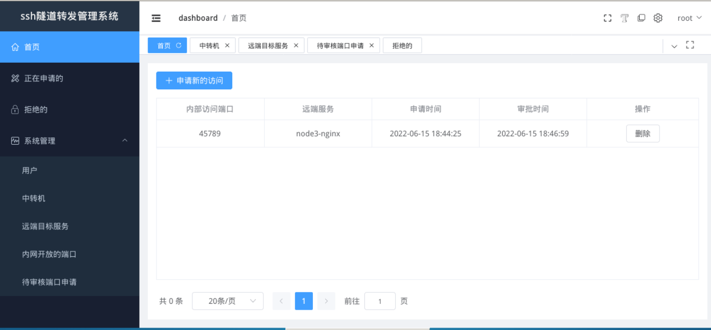
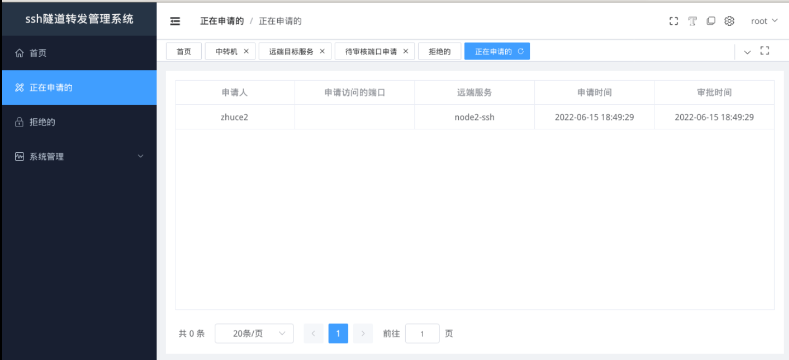
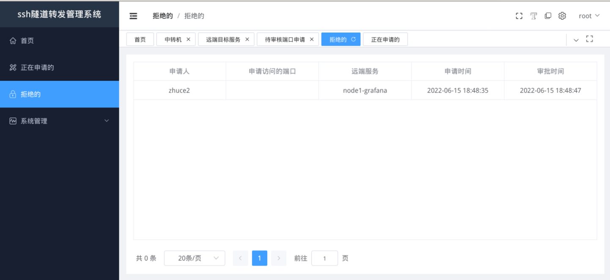
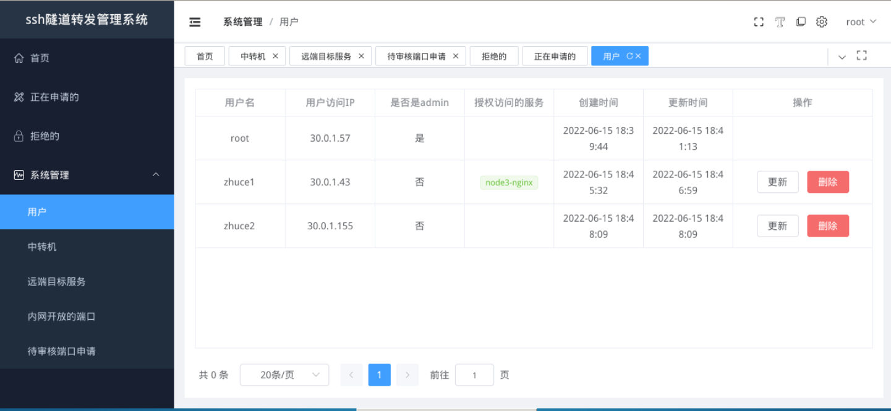
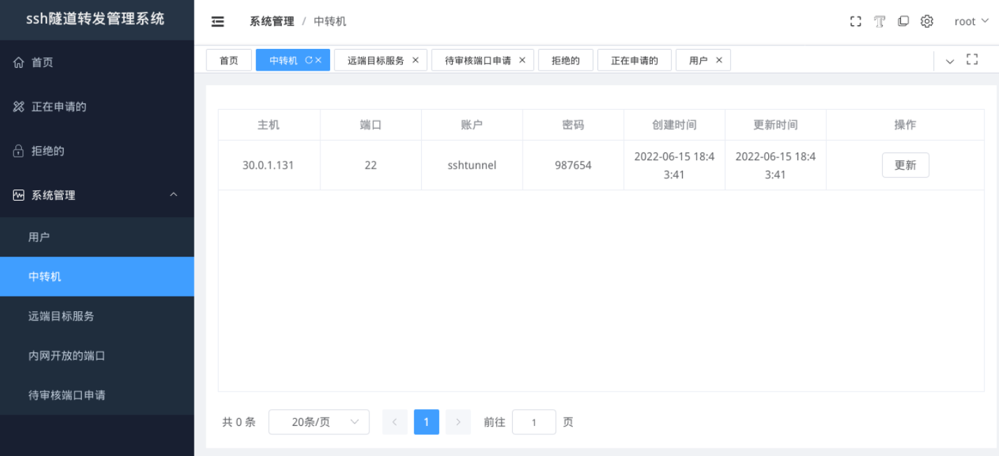
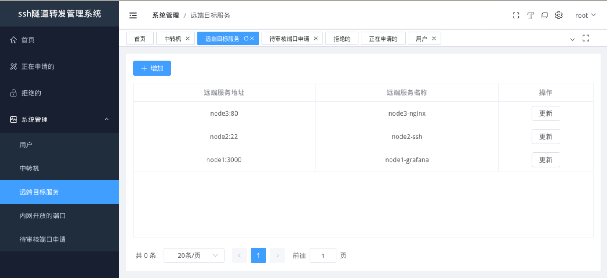
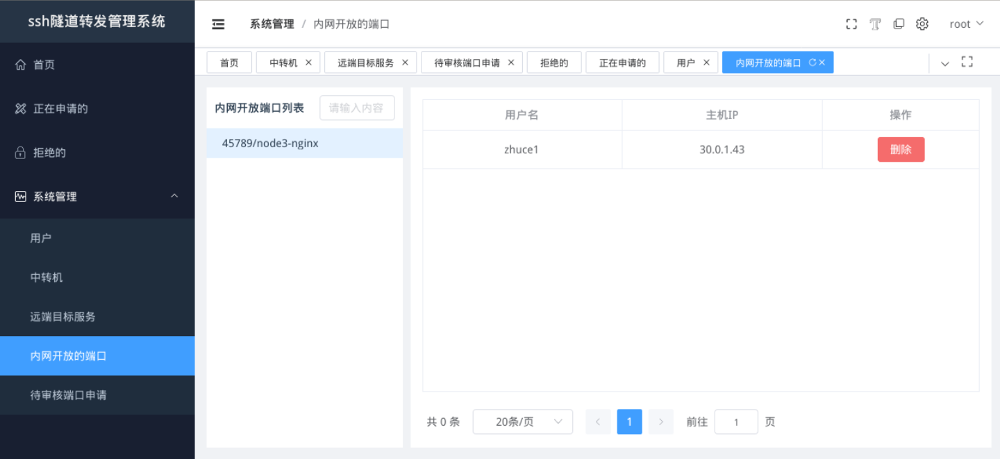
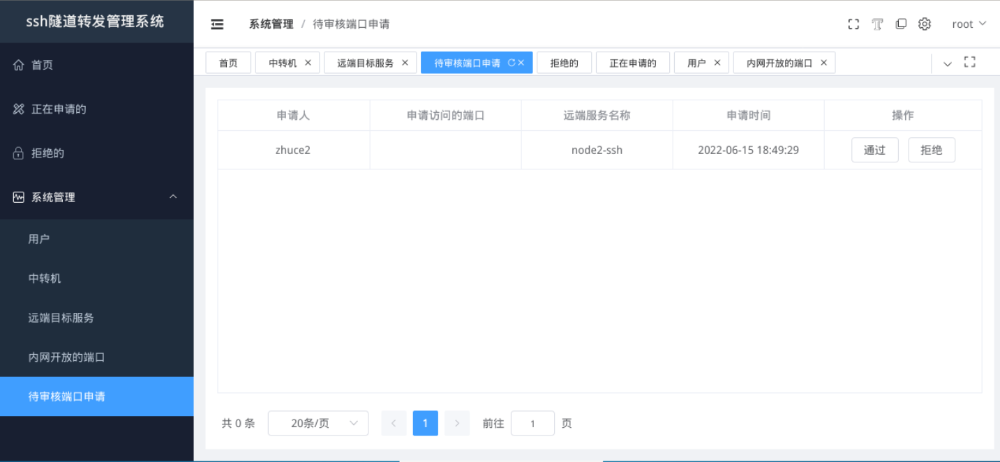
### 普通账户


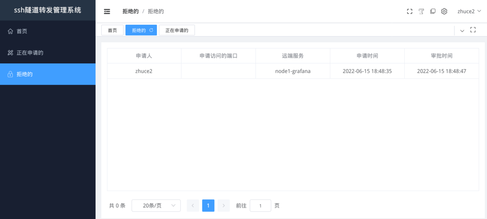
### 访问展示
#### 授权的
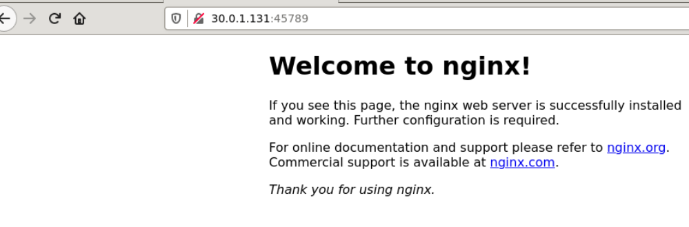
#### 未授权的
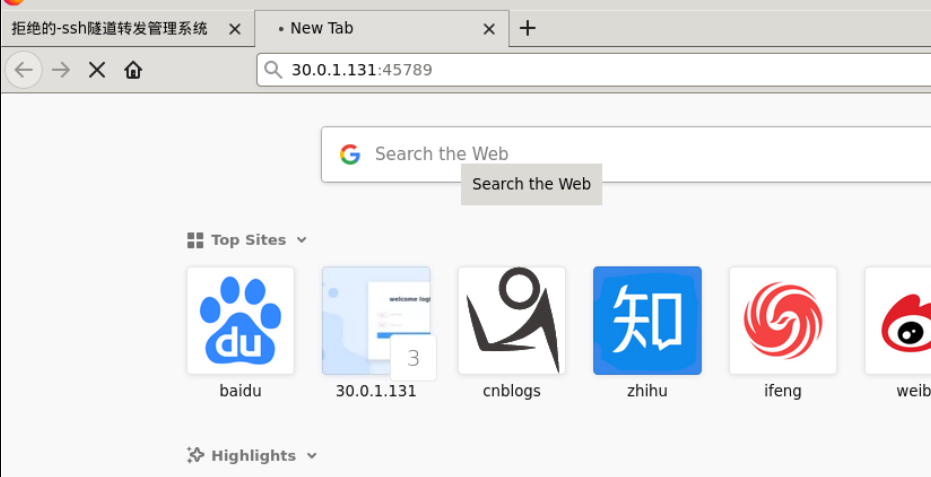

## bug
1. 所有页面显示的，没有分页功能；有分页的按钮，实际没有做分页
2. 如果之前授权的ip，被取消授权，而该用户的IP，依然有长连接(ssh/mysql连接)保持着，没有退出，那么这个连接依然可以继续使用，比如连接了远程主机的ssh，该连接一直在，并没有被删除。需要用户主动退出这个连接才行，而新建的连接肯定是不行的


## TODO
1. 
2. 